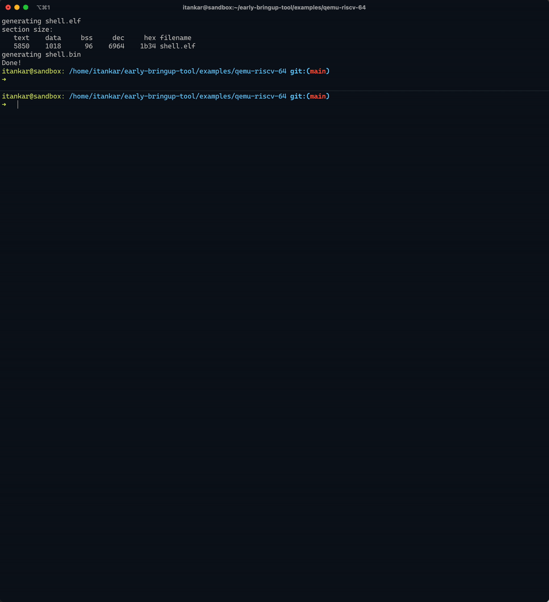

**Important disclaimer**:

    This is not an officially supported Google product

# Embedded Shell

Targeted at embedded systems engineers and researchers who want to explore the hardware by writing small functions that can be triggered from a shell like interface. This tool implemnts a UART based shell that enables finer control of CPU by allowing functions to be exposed as commands to be triggered from the prompt. With a low memory footprint of < 4kB this is a perfect tool for getting up and running with a new board in less than 1 hour.

Features:
- Low footprint shell implementation.
- Commands with same foot print as `int main(int argc, char* argv[]){}`
- Export function as command using a macro (available in `shell.h`).

# Quick Setup

Execute `./scripts/setup` to install all the dependencies.

## Quick Demo

Following is a run of example in `examples/qemu-riscv-64/`


If you haven't done the `Quick Setup` as noted above, you'll need to install following utilities:

```
sudo apt install -y binutils make binutils-riscv64-linux-gnu gcc-riscv64-linux-gnu g++-riscv64-linux-gnu \
                    qemu-system-riscv64

wget -P ~ https://git.io/.gdbinit

pip3 install pygments
```
and then:
```shell
cd examples/qemu-riscv-64/
make
make run
```

Further, gdb based debugging can also be done by running the following commands in two separate terminals:
```
make debug_run
```
and
```
make debug
```


You should see similar output as in above visual.

# Documentation

- To be able to run all the example and create your own project follow the documentation in [docs/](docs/index.md#table-of-contents).
- It also provides details about the internal workings of shell and how to setup your own project.

<hr>

# Source Code Headers

Every file containing source code must include copyright and license
information. This is to help well-intentioned people avoid accidental copying that
doesn't comply with the license.

Apache header:

    Copyright 2021 Google LLC

    Licensed under the Apache License, Version 2.0 (the "License");
    you may not use this file except in compliance with the License.
    You may obtain a copy of the License at

        https://www.apache.org/licenses/LICENSE-2.0

    Unless required by applicable law or agreed to in writing, software
    distributed under the License is distributed on an "AS IS" BASIS,
    WITHOUT WARRANTIES OR CONDITIONS OF ANY KIND, either express or implied.
    See the License for the specific language governing permissions and
    limitations under the License.
