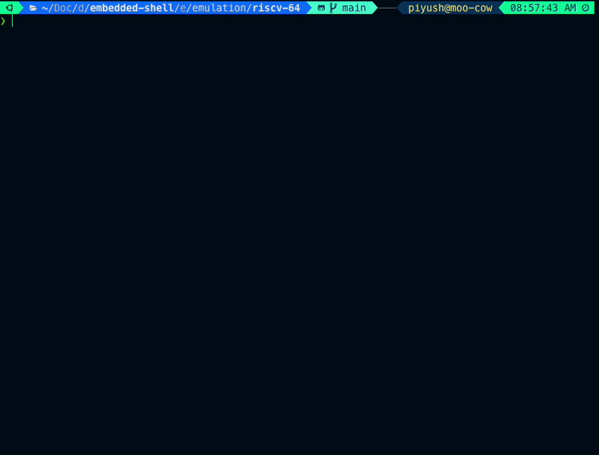

**Important disclaimer**:

    This is not an officially supported Google product

# Embedded Shell



Implementation of a `bare-metal shell`. Can be used for early bringup of embedded platforms or for the purposes of learning and research. Detailed documentation available in [docs/00-getting-sarted.md](docs/00-getting-sarted.md).

## Install Dependencies

In order to be able to run the examples in the `examples/` directory, you would need to have the following installed:
```
sudo apt install -y binutils \
                    make \
                    binutils-riscv64-linux-gnu \
                    binutils-arm-none-eabi \
                    gcc-aarch64-linux-gnu \
                    gcc-riscv64-linux-gnu \
                    g++-riscv64-linux-gnu \
                    gcc-arm-none-eabi \
                    qemu-system-riscv64 \
                    qemu-system-aarch64 \
                    qemu-system-arm \
                    qemu-system \
                    gdb-multiarch \
                    gcc-riscv64-linux-gnu \
                    openocd \
                    minicom \
                    python3-pip
```
This would allow compiling, running, uploading and debugging the code.

## GDB Dashboard
This will convert the text based GDB into a nice dashboard with all registers and
source code etc visible.
```
wget -P ~ https://git.io/.gdbinit
```
```
pip3 install pygments
```

# Qemu based targets
Following in `examples/` are qemu based.
```
qemu-armv7M-32/  qemu-armv8A-64/  qemu-riscv-64/
```
## Compiling target

Get into `qemu-riscv-64/` for the purposes of this demo:
```
cd examples/qemu-riscv-64
```
To build the source, simply execute
```
make
```
This will result in output something like below:
```
Detected Configuration
*
|- PROJECT             : shell
|- BUILD USER          : itankar
|- BUILD HOST          : sandbox
|- SHELL VERSION       : 6309660
|- USER REPO VERSION   : 6309660
|- SHELL ROOT          : /home/itankar/early-bringup-tool/shell
|- PROJECT ROOT        : /home/itankar/early-bringup-tool/examples/qemu-riscv-64
|- OPTIMIZATION        : 0
*
|- TOOLCHAIN           : riscv64-linux-gnu-
|- STARTUP             : /home/itankar/early-bringup-tool/shell/startup/riscv64.S
|- LAYOUT FILE         : /home/itankar/early-bringup-tool/shell/scatter/layout.ld
|- RAM BASE            : 0x80000000
|- RAM SIZE            : 0x4000000
`- UART BASE           : 0x10000000

>> If incorrect, please set these Variables in Makefile <<

...
generating shell.elf
section size:
   text    data     bss     dec     hex filename
   5722    1240      88    7050    1b8a shell.elf
generating shell.bin
Done!
```
`shell.elf` and `shell.bin` are the compiled outputs. These can be run on the riscv64 qemu target. Along with these files, the following helper files will also be generated - `shell.elf.lst`,  `shell.elf.map`

## Running on Qemu
Once done with the compilation above, use the following command to run the binaries on the qemu target.
```
make run
```
You should see a prompt as below:
```
➜   make run
Build: [6309660]:[6309660] - [itankar@sandbox] - Mar 24 2022 - 05:53:50
#
```
Typing `help` should reveal all the available commands. Like below:
```
➜   make run
Build: [6309660]:[6309660] - [itankar@sandbox] - Mar 24 2022 - 05:53:50
# help
hello
        Echoes the commandline
        usage: hello <any string>

r32
        reads a 32 bit memory location

w32
        writes a 32 bit value to a memory location

read
        Reads number of bytes from memory

help
        Prints all available commands

printf_examples
        Prints example usage of printf

echo
        Turn input echo on/off

version
        Prints details of the build

#
```
`hello` command is implemented in the `hello.c` file and serves as an example of how more commands can be added.

**Exit QEMU**: `ctrl+a` then `x` to exit.

# Debugging
If you want to debug by using `gdb` you would need to open two terminals wihtin the location `examples/qemu-riscv-64/` and start the `qemu` run with the board halted on terminal and then connect `gdb` to it from the second terminal.

On first terminal execute:
```
make run_debug
```
This will start the qemu target and hold the CPU in reset.

On the second terminal, execute:
```
make debug
```

This will then start `gdb` and attach it to the qemu target. You should see output as below:
```
➜ make debug
...
Remote debugging using localhost:1234
0x0000000000001000 in ?? ()
(gdb)
```

You can now use familiar gdb commands at the `(gdb)` prompt, like `break`, `continue`, `run` etc to debug the target further. If the GDB Dashboard in installed, the view shoyuld be some what as below:
```
➜ make debug
...
Reading symbols from shell.elf...
Remote debugging using localhost:1234
0x0000000000001000 in ?? ()
─── Assembly ───────────────────────────────────────────────────────────────────
 0x0000000000001000  ? auipc    t0,0x0
 0x0000000000001004  ? addi    a2,t0,40
 0x0000000000001008  ? csrr    a0,mhartid
 0x000000000000100c  ? ld    a1,32(t0)
 0x0000000000001010  ? ld    t0,24(t0)
 0x0000000000001014  ? jr    t0
 0x0000000000001018  ? unimp
 0x000000000000101a  ? 0x8000
 0x000000000000101c  ? unimp
 0x000000000000101e  ? unimp
─── Breakpoints ────────────────────────────────────────────────────────────────
─── Expressions ────────────────────────────────────────────────────────────────
─── History ────────────────────────────────────────────────────────────────────
─── Memory ─────────────────────────────────────────────────────────────────────
─── Registers ──────────────────────────────────────────────────────────────────
    zero 0x0000000000000000     ra 0x0000000000000000     sp 0x0000000000000000
      gp 0x0000000000000000     tp 0x0000000000000000     t0 0x0000000000000000
      t1 0x0000000000000000     t2 0x0000000000000000     fp 0x0000000000000000
      s1 0x0000000000000000     a0 0x0000000000000000     a1 0x0000000000000000
      a2 0x0000000000000000     a3 0x0000000000000000     a4 0x0000000000000000
      a5 0x0000000000000000     a6 0x0000000000000000     a7 0x0000000000000000
      s2 0x0000000000000000     s3 0x0000000000000000     s4 0x0000000000000000
      s5 0x0000000000000000     s6 0x0000000000000000     s7 0x0000000000000000
      s8 0x0000000000000000     s9 0x0000000000000000    s10 0x0000000000000000
     s11 0x0000000000000000     t3 0x0000000000000000     t4 0x0000000000000000
      t5 0x0000000000000000     t6 0x0000000000000000     pc 0x0000000000001000
─── Source ─────────────────────────────────────────────────────────────────────
─── Stack ──────────────────────────────────────────────────────────────────────
[0] from 0x0000000000001000
─── Threads ────────────────────────────────────────────────────────────────────
[1] id 1 from 0x0000000000001000
─── Variables ──────────────────────────────────────────────────────────────────
────────────────────────────────────────────────────────────────────────────────
>>>
```
gdb commands can be used as usual at the `>>>` prompt.

## Cleaning
Execute the following to clean the current working directory
```
make clean
```
# Board based targets

`examples/hifive-riscv-32/` implements a port for a `hifive_rev_b` board. The code can be
compiled and uploaded as follows -

## Compiling

Get into the directory
```
cd examples/hifive-riscv-32/
```

Trigger the build process
```
make
```
following should be seen
```
➜   make
...
generating shell.elf
section size:
   text    data     bss     dec     hex filename
   2818     615       8    3441     d71 shell.elf
generating shell.bin
Done!
```

## Upload and Debug

We use `openocd` to upload to the board and to debug.

### Upload

In case of an actual board the prompt will be available on the uart. Thus we would need to connect to the uart using `minicom`. Following command can be used:
```
sudo minicom -D /dev/ttyACM0
```
Something like below should be seen:
```
Welcome to minicom 2.8

OPTIONS: I18n
Port /dev/ttyACM0, 08:35:52

Press CTRL-A Z for help on special keys
...
```

Following command will upload the compiled binary to the board.
```
make upload
```
the following should be seen:
```
➜   make upload
Uploading...Open On-Chip Debugger 0.11.0
Licensed under GNU GPL v2
For bug reports, read
        http://openocd.org/doc/doxygen/bugs.html
Info : J-Link OB-K22-SiFive compiled Oct 30 2020 11:20:31
Info : Hardware version: 1.00
Info : VTarget = 3.300 V
Info : clock speed 4000 kHz
Info : JTAG tap: riscv.cpu tap/device found: 0x20000913 (mfg: 0x489 (SiFive Inc), part: 0x0000, ver: 0x2)
Info : datacount=1 progbufsize=16
Info : Disabling abstract command reads from CSRs.
Info : Examined RISC-V core; found 1 harts
Info :  hart 0: XLEN=32, misa=0x40101105
Info : starting gdb server for riscv.cpu.0 on 3333
Info : Listening on port 3333 for gdb connections
Info : Found flash device 'issi is25lp032' (ID 0x0016609d)
Ready for Remote Connections
Info : JTAG tap: riscv.cpu tap/device found: 0x20000913 (mfg: 0x489 (SiFive Inc), part: 0x0000, ver: 0x2)
** Programming Started **
Info : Disabling abstract command writes to CSRs.
** Programming Finished **
** Verify Started **
** Verified OK **
** Resetting Target **
Info : JTAG tap: riscv.cpu tap/device found: 0x20000913 (mfg: 0x489 (SiFive Inc), part: 0x0000, ver: 0x2)
shutdown command invoked
Done :)
```

The prompt should be seen on the `minicom` window.
```
Welcome to minicom 2.8

OPTIONS: I18n
Port /dev/ttyACM0, 08:35:52

Press CTRL-A Z for help on special keys

Bench Clock Reset Complete

ATE0--> Send Flag error: #255 #255 #255 #255 AT+BLEINIT=0--> Send Flag error: #255 #255 #255 #255 AT+CWMODE=0--> Send Flag er
Build: [6309660]:[6309660] - [itankar@sandbox] - Mar 24 2022 - 05:53:50
#


...
```
We can now type commands at the prompt much like in case of the `qemu` based targets.

## Debugging
We can use `make debug` and `make gdb` on two separate terminals to start a gdb server via `openocd` and then connect `gdb` to it. Executing each command should show the following -

Terminal 1:
```
➜ make debug
GDB server active...
Use Ctrl+c to close the server!
```

Terminal 2:
```
➜   make gdb
Reading symbols from shell.elf...
0x00001004 in ?? ()
─── Assembly ───────────────────────────────────────────────────────────────────
 0x00001004  ? auipc    t0,0x0
 0x00001008  ? lw    t1,-4(t0)
 0x0000100c  ? slli    t1,t1,0x3
 0x00001010  ? add    t0,t0,t1
 0x00001014  ? lw    t0,252(t0)
 0x00001018  ? jr    t0
 0x0000101c  ? unimp
 0x0000101e  ? unimp
 0x00001020  ? unimp
 0x00001022  ? unimp
─── Breakpoints ────────────────────────────────────────────────────────────────
─── Expressions ────────────────────────────────────────────────────────────────
─── History ────────────────────────────────────────────────────────────────────
─── Memory ─────────────────────────────────────────────────────────────────────
─── Registers ──────────────────────────────────────────────────────────────────
         zero 0x00000000               ra 0x20010a2c              sp 0x80003f80
           gp 0x80000d80               tp 0x00000000              t0 0x00000000
           t1 0x00000000               t2 0x800005d0              fp 0x00000000
           s1 0x00000000               a0 0x80000068              a1 0x20010c2c
           a2 0x20010c2c               a3 0x20010c24              a4 0x0000000f
           a5 0x10013000               a6 0x00000003              a7 0x00000000
           s2 0x00000000               s3 0x00000000              s4 0x00000000
           s5 0x00000000               s6 0x00000000              s7 0x00000000
           s8 0x00000000               s9 0x00000000             s10 0x00000000
          s11 0x00000000               t3 0x80000170              t4 0x00000000
           t5 0x00000000               t6 0x00000000              pc 0x00001004
         utvt 0x00000000             vcsr 0x00000000           unxti 0x00000000
   uintstatus 0x00000000      uscratchcsw 0x00000000    uscratchcswl 0x00000000
         stvt 0x00000000            snxti 0x00000000      sintstatus 0x00000000
  sscratchcsw 0x00000000     sscratchcswl 0x00000000        vsstatus 0x00000000
         vsie 0x00000000           vstvec 0x00000000       vsscratch 0x00000000
        vsepc 0x00000000          vscause 0x00000000          vstval 0x00000000
         vsip 0x00000000            vsatp 0x00000000            mtvt 0x00000000
     mstatush 0x00000000            mnxti 0x00000000      mintstatus 0x00000000
  mscratchcsw 0x00000000     mscratchcswl 0x00000000          mtinst 0x00000000
       mtval2 0x00000000       htimedelta 0x00000000      hcounteren 0x00000000
        hgeie 0x00000000      htimedeltah 0x00000000           htval 0x00000000
         hvip 0x00000000           htinst 0x00000000           hgatp 0x00000000
        hgeip 0x00000000
─── Source ─────────────────────────────────────────────────────────────────────
─── Stack ──────────────────────────────────────────────────────────────────────
[0] from 0x00001004
[1] from 0x20010a2c in shell+220 at /home/itankar/early-bringup-tool/shell/shell.c:204
[2] from 0x00000000
─── Threads ────────────────────────────────────────────────────────────────────
[1] id 0 from 0x00001004
─── Variables ──────────────────────────────────────────────────────────────────
───────────────────────────────────────────────────────────────────────────────-
JTAG tap: riscv.cpu tap/device found: 0x20000913 (mfg: 0x489 (SiFive Inc), part: 0x0000, ver: 0x2)
keep_alive() was not invoked in the 1000 ms timelimit. GDB alive packet not sent! (2096 ms). Workaround: increase "set remotetimeout" in GDB
>>>
```
<hr>

# Source Code Headers

Every file containing source code must include copyright and license
information. This is to help well-intentioned people avoid accidental copying that
doesn't comply with the license.

Apache header:

    Copyright 2021 Google LLC

    Licensed under the Apache License, Version 2.0 (the "License");
    you may not use this file except in compliance with the License.
    You may obtain a copy of the License at

        https://www.apache.org/licenses/LICENSE-2.0

    Unless required by applicable law or agreed to in writing, software
    distributed under the License is distributed on an "AS IS" BASIS,
    WITHOUT WARRANTIES OR CONDITIONS OF ANY KIND, either express or implied.
    See the License for the specific language governing permissions and
    limitations under the License.
