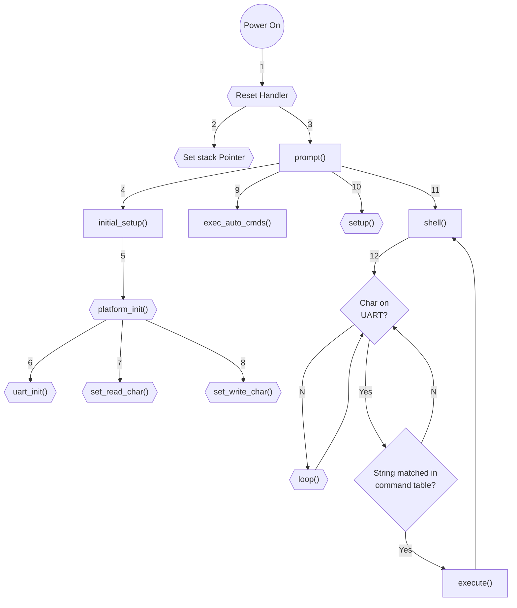

<!--

Copyright 2022 Google LLC

Licensed under the Apache License, Version 2.0 (the "License");
you may not use this file except in compliance with the License.
You may obtain a copy of the License at

    https://www.apache.org/licenses/LICENSE-2.0

Unless required by applicable law or agreed to in writing, software
distributed under the License is distributed on an "AS IS" BASIS,
WITHOUT WARRANTIES OR CONDITIONS OF ANY KIND, either express or implied.
See the License for the specific language governing permissions and
limitations under the License.

-->

# How Shell works

Implementation of the shell can be found in `shell/shell.c`. Elements in `hexagons` are to be provided by the user (check the `examples/` for sample implementation) and those in `rectangle` are functions that the `shell.c` implements and uses.

Shell is implemented around the idea of registering commands in a `command table` during development/compile time, scanning the uart in runtime and if a string matches that stored in the command table, then execute the associated function.

The state machine can be understood based on the flow chart below.

1. `Reset Handler` is the entry point after power on.
1. The `stack pointer` register (sp) is loaded with memory address that will be used as stack.
    1. This is required for the function calls to work correctly.
1. The reset handler then jumps to `prompt()` which never returns.
1. `prompt()` jumps to `initial_setup()`.
1. `initial_setup()` executes a platform initialization routine (`platform_init()`).
    1. `platform_init()` is a user implemented function that configures the uart and provides shell with two functions that can help it read and write a character on the uart.
    1. This is achieved by calling `uart_init()`, `set_read_char()` and `set_write_char()`.
1. `uart_init()` implements the configuration and setup of the uart. Because each board/target may have different uart and thus need a different configuration, this function is to be provided by the user.
    1. `uart_getc()` and `uart_putc()` are other two functions that the user would need to implement (not shown in diagram).
    1. These implement a polling based uart read and write respectively.
1. `set_read_char()` is used to register `uart_getc()` as a function pointer in shell. Shell then uses this function to read a character from the uart.
1. `set_write_char()` is used to register `uart_putc()` as a function pointer, when then enables the shell to put a character on the uart.
1. After the `initial_setup()` the state-machine executes `exec_auto_cmds()`. This then essentially goes on to executing functions that were registered in the shell to be executed automatically once. An example of this is `build_info()`.
1. [Optional] `setup()` allows one time execution, the user may call other functions from this that are to be executed only once. **This is optional** and the user may skip the implementation.
1. `shell()` is the infinite loop!

## Shell()

`shell()` implement a scan loop that continuously checks the uart for any bytes and if available stores them in a buffer until `\n` or `\r` is not seen. `shell()` works as follows:
1. Scans a character from the uart.
1. If there was no valid character, then it executes `loop()` once and returns to (i).
1. Else, if there was a character found then it -
    1. Records it in a buffer and checks if it was `\n` or `\r`.
    1. If the character was line terminator (i.e `\r` or `\n`), then it calls `execute()` which then processes the buffer and checks in the command table if any functions pointer is available against the strings in buffer. If `yes` then, it executes the command. If not, then it returns and `shell()` is called again.

## Arduino Style Firmware design

`setup()` and `loop()` are both **optional functions** that the user can implement. The idea is that -
1. `setup()` implements a one time setup, and
1. `loop()` is called over and over again.

User can choose to leave these functions unimplemented. One can expect (if implemented) the `setup()` to be called just once and `loop()` to be called over and over as depicted in the flow chart. This together then gives a linux like environment where the prompt is available for the user to use and there can be functions getting called in the back ground.

**The only limitation is that the `loop()` should not have an infinite loop within it!**
